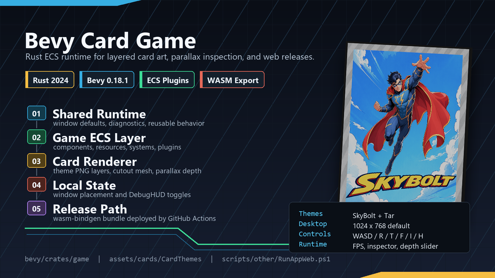
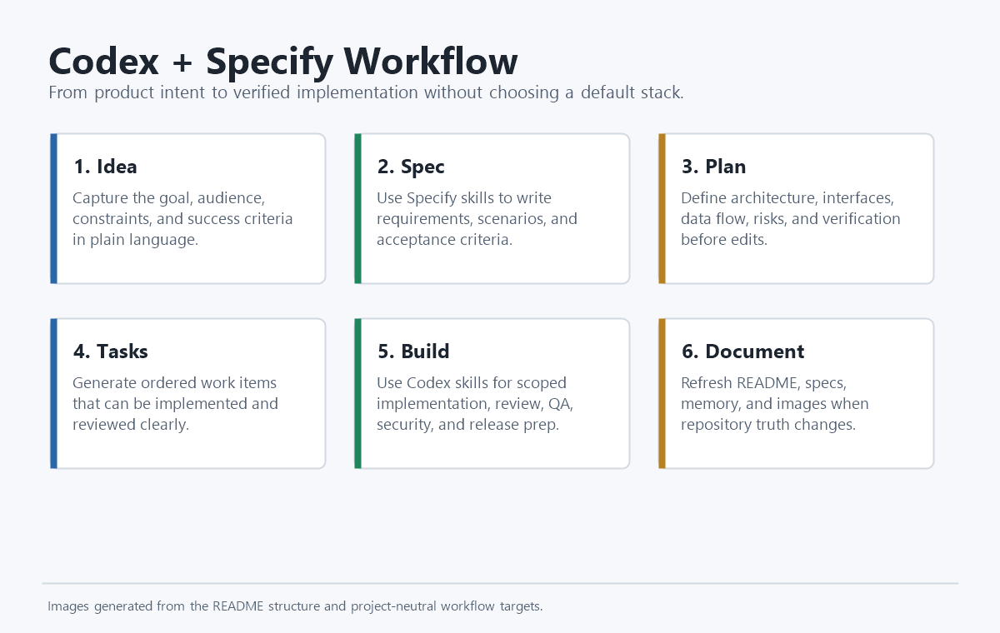

# Bevy Card Game

A Bevy ECS card game project built from the Codex Project Template.





## Getting Started

| Task | Command |
| ---- | ------- |
| Install dependencies once | `scripts/main/InstallDependencies.ps1` |
| Run tests | `scripts/other/RunTests.ps1` |
| Run desktop | `scripts/other/RunAppDesktop.ps1` |
| Run desktop hot reload | `scripts/main/RunAppDesktopHotReload.ps1` |
| Check desktop | `scripts/other/RunAppDesktop.ps1 -CheckOnly` |
| Run web | `scripts/other/RunAppWeb.ps1` |
| Check web | `scripts/other/RunAppWeb.ps1 -CheckOnly` |
| Export web | `scripts/other/RunAppWeb.ps1 -Release -NoOpen -ExportOnly` |
| Export release web | `scripts/other/ExportWebRelease.ps1` |
| Stop app | `scripts/other/StopApp.ps1` |

## Live Demo

https://samuelasherrivello.github.io/bevy-card-game/latest/

The static web build is exported and hosted when a GitHub Release is published. Versioned releases live under `/releases/<version>/`, and `/latest/` points at the newest release.

## Runtime Controls

| Key | Behavior |
| --- | -------- |
| `W` / `A` / `S` / `D` | DebugHUD hold indicators for directional input state. |
| `R` | Reloads the card browser scene content without restarting the app. |
| `T` | In GameScene, cycles the active world between Bamboo Forest and Coastal Harbor; in Card Browser, cycles global CardUI presentation settings. |
| `F` | Toggles the FPS readout. |
| `I` | Toggles the Bevy inspector window. |
| `H` | Toggles persisted desktop hot-reload auto-restart behavior. |
| `Escape` | Invisible key: requests the same app close flow as the desktop title-bar close button. |

## Requirements

| Requirement | Purpose |
| ----------- | ------- |
| Windows package manager | `InstallDependencies.ps1` can install rustup through `winget` when Rust is not already installed. If `winget` is unavailable, install rustup manually from <https://rustup.rs/>. |
| Rust toolchain | `InstallDependencies.ps1` installs and verifies the `stable` Rust toolchain. |
| Rust target | `InstallDependencies.ps1` installs and verifies `x86_64-pc-windows-msvc`. |
| Cargo | `InstallDependencies.ps1` verifies `cargo` is available after rustup setup. If it is not found, restart the terminal and rerun the script. |
| Dioxus CLI | `InstallDependencies.ps1` verifies or installs Dioxus CLI 0.7.x for desktop hot reload. Pass `-SkipHotReloadTools` to skip this optional setup. |
| MSVC linker | Desktop builds may require `link.exe`. Install Build Tools for Visual Studio from <https://visualstudio.microsoft.com/visual-cpp-build-tools/> with the `Desktop development with C++` workload. |
| Fast linker | `rust-lld` is optional. When available, the scripts use it for faster desktop linking; otherwise they fall back to the default Windows linker. |

## Build Speed

| Setting | Behavior |
| ------- | -------- |
| Desktop target | `scripts/other/RunAppDesktop.ps1` uses the host target with a dedicated `target/run-app-desktop` cache so other Cargo tasks do not invalidate warm runs. |
| First checkout | `scripts/main/InstallDependencies.ps1` warms the same desktop cache once, so later `RunAppDesktop.ps1` calls only rebuild changed code. |
| Default run | `scripts/other/RunAppDesktop.ps1` compiles only changed artifacts, then opens the cached desktop executable. |
| Headless compile helper | `scripts/other/CompileApp.ps1` centralizes Cargo build, check, and test setup for the main run scripts. |
| Fast validation | `scripts/other/RunAppDesktop.ps1 -CheckOnly` runs `cargo check -p bevy-card-game --features fast-dev` without launching the app. |
| Fast dev feature | Non-release desktop runs enable `fast-dev`, which turns on Bevy dynamic linking for faster edit-run cycles after the first build. |
| Desktop hot reload | `scripts/main/RunAppDesktopHotReload.ps1` uses Dioxus CLI hot patching with `target/run-app-desktop-hot-reload` and keeps output in the terminal. |
| Web target | `scripts/other/RunAppWeb.ps1` builds `wasm32-unknown-unknown` into `target/run-app-web`, runs `wasm-bindgen`, serves the generated page on localhost, and opens the browser. |
| Explicit target | Pass `-TargetTriple x86_64-pc-windows-msvc` only when a separate target cache is required. |

## Structure

| Path | Purpose |
| ---- | ------- |
| `.github` | GitHub Actions and repository automation, including release and web export workflows. |
| `deploy.vps.env` | Public, non-secret VPS deployment defaults used by `ReleaseWebBuildToVps`. |
| `bevy/crates/game` | Main Bevy game crate and executable for card-specific runtime behavior. |
| `bevy/crates/game/src/runtime/components` | Card-specific ECS data attached to entities. |
| `bevy/crates/game/src/runtime/resources` | Card-specific ECS resources and inspection state. |
| `bevy/crates/game/src/runtime/systems` | Card-specific setup, pointer mapping, smoothing, and DebugHUD composition. |
| `bevy/crates/game/src/runtime/plugins` | Game plugin composition and card POC tests. |
| `bevy/crates/game/assets/cards/card_types/card_type_kage_ren` | Generated Kage Ren card textures. |
| `bevy/crates/game/assets/cards/card_types/card_type_lord_daichi` | Generated Lord Daichi card textures. |
| `bevy/crates/game/assets/cards/card_types/card_type_sister_hotaru` | Generated Sister Hotaru card textures. |
| `bevy/crates/game/assets/cards/card_types/card_type_yokai_placeholder` | Generated temporary Yokai placeholder card textures. |
| `bevy/crates/game/assets/worlds/bamboo_forest` | Generated Bamboo Forest world background. |
| `bevy/crates/game/assets/worlds/coastal_harbor` | Generated Coastal Harbor world background. |
| `bevy/crates/game/assets/locations` | Generated reusable tactical location textures. |
| `bevy/crates/shared` | Reusable system-level Rust logic for shared runtime behavior. |
| `bevy/crates/shared/src/window.rs` | Project-approved desktop window defaults: 1024x768. |
| `data/local_storage` | Local persisted runtime state for window placement and DebugHUD input toggles. |
| `.codex` | Repo-local Codex guidance, skills, memory, and rules. |
| `.specify` | Specify workflow configuration and constitution. |
| `specs` | Active project specs. |
| `scripts` | Repeatable local commands. |
| `documentation/images` | README-visible supporting images. |

## Stack

| Area | Choice |
| ---- | ------ |
| Language | Rust 2024 |
| Engine | Bevy 0.18.1 |
| Runtime dependencies | `bevy-inspector-egui`, `bevy-persistent`, `serde`, `serde_json`; optional `dioxus-devtools` for desktop hot reload |
| Architecture | Shared runtime crate plus game-specific ECS components, resources, systems, plugins, generated card-type assets, and local persisted runtime state |
| Workspace | Cargo workspace rooted at this repository |

## Development Notes

Keep gameplay changes small and spec-driven. Reusable system-level behavior belongs in `bevy/crates/shared`; card-specific geometry, card types, pointer mapping, smoothing, DebugHUD composition, inspector UI, and scene reload behavior belongs in `bevy/crates/game`.

## GitHub Features

| Related tech | Link |
| ------------ | ---- |
| GitHub Actions | [GitHub Actions docs](https://docs.github.com/en/actions) |
| GitHub Pages | [Custom GitHub Pages workflows](https://docs.github.com/en/pages/getting-started-with-github-pages/using-custom-workflows-with-github-pages) |

Keep [`.github/workflows/export-web-build-to-github-pages.yml`](./.github/workflows/export-web-build-to-github-pages.yml) as the only GitHub Pages deployment workflow. Do not create a branch-based Pages action; it can fight with this custom export workflow.

Choose one setup option:

| Option | Instructions |
| ------ | ------------ |
| Enable Pages manually | In GitHub, open `Settings > Pages` and set `Source` to `GitHub Actions`. Do not select a branch source. |
| Add `PAGES_ADMIN_TOKEN` | Add a repository secret named `PAGES_ADMIN_TOKEN` with Pages write permission so the workflow can enable or repair Pages setup without creating another action. |

The GitHub Actions display names are:

| Workflow | Purpose |
| -------- | ------- |
| `PerformRelease` | Manually increments `VERSION.txt`, updates Cargo package versions, commits, tags, and creates a GitHub Release. |
| `ReleaseWebBuildToGithubPages` | Builds the release web app and publishes `/releases/<version>/` plus `/latest/` to GitHub Pages. |
| `ReleaseWebBuildToVps` | Builds the release web app and publishes it to the configured VPS app directory. |

## Release Deployment

Use GitHub Releases as the publishing boundary. Normal commits do not publish the project. To publish, run the `PerformRelease` workflow manually.

[`VERSION.txt`](./VERSION.txt) is the release source of truth. It stores the public project version without the tag prefix, such as `0.01`. Release tags add `v`, such as `v0.01`.

The release workflow uses this version style:

| `VERSION.txt` | Git tag | Cargo package version |
| ------------- | ------- | --------------------- |
| `0.01` | `v0.01` | `0.1.0` |
| `0.02` | `v0.02` | `0.2.0` |
| `0.03` | `v0.03` | `0.3.0` |

Each published release builds the public Bevy web target for GitHub Pages.

If the Pages workflow is run manually, leave the release version input blank to use the current `VERSION.txt`. Enter a value like `v0.01` only when redeploying a specific release folder.

The reusable release web export script is [`scripts/other/ExportWebRelease.ps1`](./scripts/other/ExportWebRelease.ps1). It calls the standard web build, writes `404.html`, and validates the expected web bundle and card type assets before deployment workflows upload the result.

## GitHub Pages URLs

| URL | Purpose |
| --- | ------- |
| `/latest/` | Newest published release. |
| `/releases/v0.01/` | Specific immutable release folder. |

The Pages workflow stores release folders on the `pages-releases` branch, then deploys them through GitHub Pages Actions. Keep the repository Pages source set to `GitHub Actions`, not a branch.

## VPS Deployment

The VPS workflow uses [`deploy.vps.env`](./deploy.vps.env) for public, reusable deployment settings and GitHub repository secrets for private SSH access. The default remote app path is `/srv/apps/bevy-card-game`, with release folders under `/srv/apps/bevy-card-game/releases` and a `current` symlink pointing at the active release.

Public deployment settings:

| Setting | Purpose |
| ------- | ------- |
| `APP_NAME` | Short app name used for release archive names. |
| `WEB_RELEASE_SCRIPT` | Repo script that builds and validates the release web bundle. |
| `DEPLOY_STATIC_PATHS` | Comma-separated `local/source|/public/path/` mappings for browser-visible files. |
| `REMOTE_APP_DIR` | VPS app root containing releases and the active symlink. |
| `REMOTE_RELEASES_DIR` | Folder under `REMOTE_APP_DIR` for timestamped release directories. |
| `REMOTE_CURRENT_LINK` | Symlink under `REMOTE_APP_DIR` that points to the active release. |
| `REMOTE_SERVICE_NAME` | Optional systemd service to restart after deploy. Leave blank for static-file deployments. |
| `DEPLOY_KEEP_RELEASES` | Number of previous VPS release folders to keep. |
| `PUBLIC_WEB_ROOT` | Optional Nginx-served public folder for browser access. |
| `PUBLIC_APP_PATH` | Optional public URL path below `PUBLIC_WEB_ROOT`. |
| `PUBLIC_HEALTHCHECK_PATH` | Public path checked after deploy, relative to `PUBLIC_APP_PATH`. |

To make VPS deployments immediately browser-visible, install the shared static app router once on the VPS:

```bash
sudo bash scripts/vps/InstallStaticWebRouter.sh <deploy-user>
```

This installs Nginx, serves `/srv/www` publicly on HTTP port `80`, and lets each project expose its active release through a symlink like `/srv/www/bevy-card-game -> /srv/apps/bevy-card-game/current`. The public URL for this repo is `http://<vps-host>/bevy-card-game/`.

Port `80` is public web traffic. Do not place private admin tools, API credentials, wallet files, server notes, or other secrets under `/srv/www` or deployed app bundles.

For this static Bevy game, `DEPLOY_STATIC_PATHS=target/run-app-web/site|/` means the exported web bundle is the only folder packaged for deployment, and it is served at `/bevy-card-game/`. Additional browser-visible folders can be mapped with comma-separated entries, such as `target/docs|/docs/`. Do not map server binaries or private files into `DEPLOY_STATIC_PATHS`.

The VPS deploy publishes three browser URL shapes for public static builds:

| URL | Purpose |
| --- | ------- |
| `/bevy-card-game/` | Newest deployed release. |
| `/bevy-card-game/latest/` | Alias for the newest deployed release. |
| `/bevy-card-game/v0.02/` | Versioned release path using the resolved release tag. |

Required GitHub repository secrets:

| Secret | Purpose | Public-safe example |
| ------ | ------- | ------------------- |
| `VPS_HOST` | VPS hostname or IP address. | `example.com` |
| `VPS_USER` | Limited deploy user on the VPS. | `deploy` |
| `VPS_SSH_PORT` | SSH port for the VPS. | `22` |
| `VPS_SSH_PRIVATE_KEY` | Private deploy key for the limited VPS deploy user. | Do not print or commit this value. |
| `VPS_KNOWN_HOSTS` | Pinned SSH host key entry for the VPS. | Generate from the trusted VPS host key. |

The VPS workflow validates these five secrets and runs a pinned-host-key SSH preflight before installing Rust tooling or building the web bundle. Missing secrets, an invalid port, malformed SSH key material, host key mismatch, connection timeout, or public-key login failure should fail near the start of the job.

The deploy user should only have write access to the configured app directory. If `REMOTE_SERVICE_NAME` is set, allow that user to restart only that one service with `sudo systemctl restart <service>`.

Add the secrets in GitHub under `Settings > Secrets and variables > Actions > Repository secrets`. Use `New repository secret` once for each name above. Do not put secret values in `deploy.vps.env`, commit history, issues, pull requests, screenshots, or README text.

Use a dedicated SSH key for this repository deployment. Store the private key content in `VPS_SSH_PRIVATE_KEY`, and install only the matching public key in the deploy user's `authorized_keys` file on the VPS. The deploy user should not be a personal admin user.

Create `VPS_KNOWN_HOSTS` from a trusted terminal after verifying the server identity out of band:

```bash
ssh-keyscan -p <ssh-port> <vps-host>
```

Copy the resulting host key line into the `VPS_KNOWN_HOSTS` repository secret. Do not replace this with automatic host-key trust in the workflow; the pinned host key helps prevent deploying to an impersonated server.

Public configuration belongs in `deploy.vps.env`; private access belongs in GitHub repository secrets:

| Location | Put this there | Do not put this there |
| -------- | -------------- | --------------------- |
| `deploy.vps.env` | App name, build output path, remote app folder, release retention count. | SSH private keys, passwords, tokens, cookies, private host notes. |
| GitHub repository secrets | SSH private key, SSH host, SSH user, SSH port, pinned known-hosts entry. | Build paths or app defaults that other users should customize in the repo. |

## Credits

Created by Samuel Asher Rivello.

## License

Provided as-is under [MIT License](./LICENSE).
